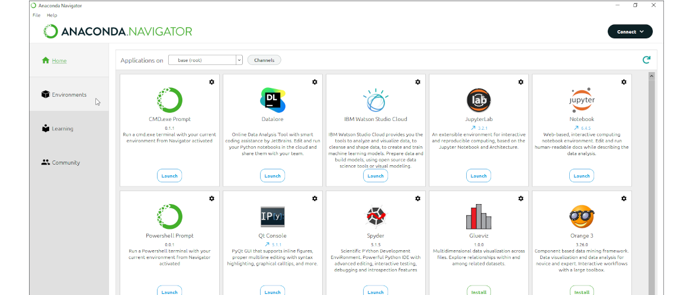
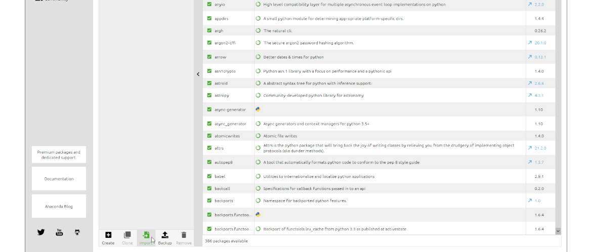
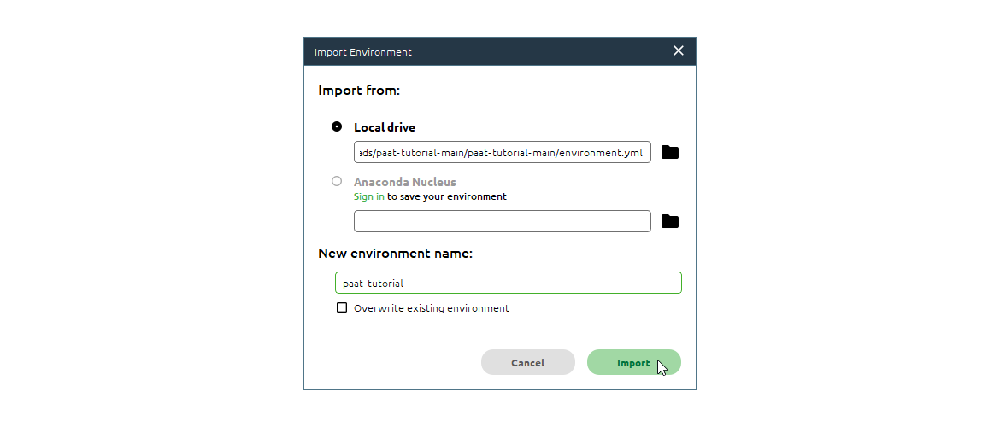
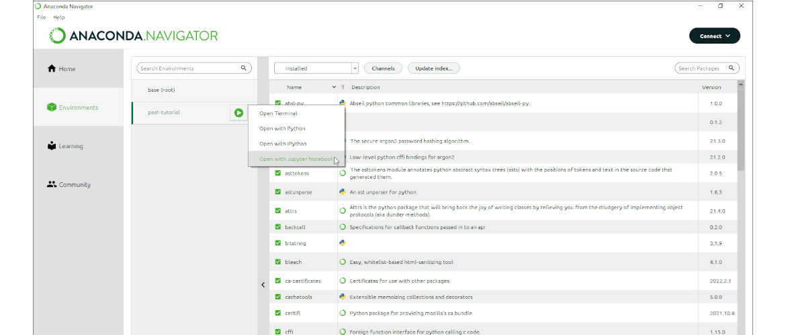
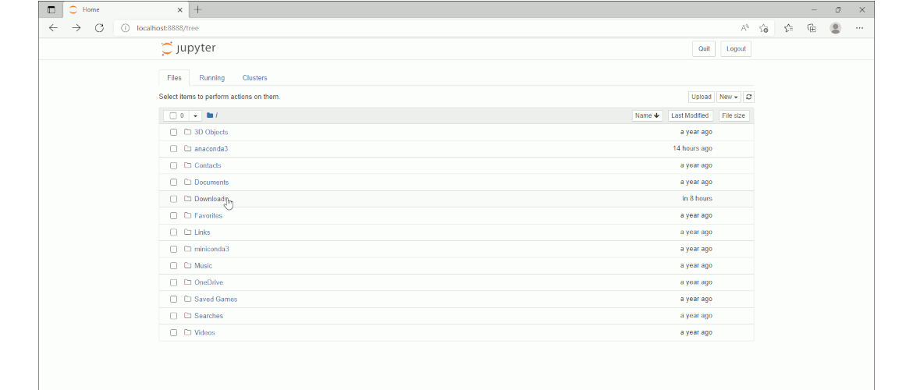

# Tutorial on how to use PAAT

This repository contains a small tutorial on how to setup [Anaconda Navigator](https://anaconda.org/anaconda/anaconda-navigator) and [PAAT](https://github.com/Trybnetic/paat) to process your ActiGraph GT3X data.

## Getting started

1. [Download](https://github.com/Trybnetic/paat-tutorial/archive/refs/heads/main.zip) this tutorial

2. Extract the file on your PC

3. Download and install [Anaconda Navigator](https://anaconda.org/anaconda/anaconda-navigator)

4. Start Anaconda Navigator and select "Environments" on the left side

5. Select "Import" on the bottom of the page

6. Import the `environment.yml` in Anaconda Navigator an give it a name (e.g. `paat-tutorial`)

7. Start Jupyter Notebook in the environment

8. Start the `tutorial.ipynb` by navigating to where you have extracted the ZIP file

9. Play around with the tutorial or adapt it to your own needs

## Acknowledgments

This work was supported by the High North Population Studies at UiT The Arctic
University of Norway.
